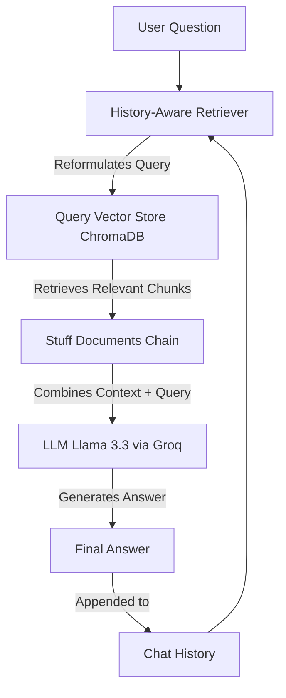

# LangChain Chatbots & Q&A Retrieval Learning Repository 🦜🤖

## Repository Description
Welcome to the **LangChain Chatbots & Q&A Retrieval Learning Repository**! This repository serves as a comprehensive, hands-on learning hub designed to master the fundamentals and advanced concepts of building LLM-powered applications using **LangChain**. 

Whether you are a beginner looking to understand what a "Retriever" or a "Document" is, or an intermediate developer building stateful conversational agents with Retrieval-Augmented Generation (RAG) and message trimming, this repository provides step-by-step implementations inside interactive Jupyter Notebooks. The project leverages top-tier tools like **Groq (Llama 3.3)**, **HuggingFace Embeddings**, and **ChromaDB** for efficient, local vector storage.

---

## 📋 Table of Contents
1. [Repository Structure](#-repository-structure)
2. [Learning Objectives](#-learning-objectives)
3. [Topics Covered](#-topics-covered)
4. [Technologies Used](#-technologies-used)
5. [Installation & Setup](#-installation--setup)
6. [Environment Variables](#-environment-variables)
7. [How to Run the Notebooks](#-how-to-run-the-notebooks)
8. [Repository Workflow](#-repository-workflow)
9. [What I Learned](#-what-i-learned)
10. [Future Improvements](#-future-improvements)
11. [Contributing](#-contributing)
12. [License](#-license)
13. [Author](#-author)

---

## 📂 Repository Structure
Below is an overview of the key files in this repository:

*   **`1-chatbots.ipynb`**: Demonstrates the fundamentals of building conversational chatbots. It covers memory integration, managing chat history, wrapping chains with `RunnableWithMessageHistory`, using prompt templates with system instructions and placeholders, handling multiple input variables (like language), and using `trim_messages` to prevent token window overflow.
*   **`conversationqaChatbot.ipynb`**: Focuses on Conversational Retrieval-Augmented Generation (RAG). It highlights the challenges of standard retrieval chains without chat history (e.g., handling pronouns like "it" or "they"), and implements a **history-aware retriever** to reformulate search queries dynamically.
*   **`vectorretriever.ipynb`**: Introduces the concepts of Documents, Vector Stores, and Retrievers in LangChain. It walks through creating sample documents, initializing a local `Chroma` vector store using HuggingFace embeddings (`all-MiniLM-L6-v2`), performing similarity searches (synchronous, asynchronous, and with scores), and building RAG pipelines using LangChain Expression Language (LCEL).
*   **`requirements.txt`**: Specifies all required Python libraries, packages, and their exact versions for local installation.
*   **`theory.txt`**: A concise reference sheet containing key theoretical definitions of LangChain terminologies, including *Retrievers*, the *Runnable interface*, and *create_stuff_documents_chain*.
*   **`.env`**: (Ignored by Git) Stores external service API keys (Groq, OpenAI, HuggingFace, and LangChain/LangSmith).

---

## 🎯 Learning Objectives
*   Understand stateful vs. stateless LLM interactions.
*   Learn how to manage and persist conversational history across multiple sessions.
*   Implement message trimming strategies (`trim_messages`) to handle LLM context windows efficiently.
*   Understand the Document-Vector Store-Retriever architecture.
*   Build custom and standard retrievers using `Chroma` and `HuggingFaceEmbeddings`.
*   Solve the "pronoun resolution" issue in multi-turn conversational search using `create_history_aware_retriever`.
*   Compose robust pipelines using LangChain Expression Language (LCEL).

---

## 📚 Topics Covered
*   **LLM Integration**: Utilizing Groq API to query advanced open-weights models (`llama-3.3-70b-versatile`).
*   **Chat History Management**: Implementing `ChatMessageHistory` and mapping it to configurable session IDs.
*   **Prompt Templating**: Designing modular `ChatPromptTemplate` with `MessagesPlaceholder` to dynamically inject message history and variables.
*   **Message Trimming**: Restricting token footprint using token count strategies (`strategy="last"`, `start_on="human"`).
*   **Vector Search & Indexing**: Generating embeddings, performing similarity search, and understanding Maximum Inner Product Search (MIPS) theory.
*   **Conversational RAG**: Building search chains that are aware of the conversational state to answer questions using external web data (`WebBaseLoader`).

---

## 🛠️ Technologies Used
*   **Core Framework**: [LangChain](https://github.com/langchain-ai/langchain) (Core, Community, Classic, Chroma, Groq, HuggingFace)
*   **LLM Providers**: [Groq Cloud](https://console.groq.com/) (Llama 3.3), [OpenAI](https://openai.com/)
*   **Vector Database**: [ChromaDB](https://www.trychroma.com/)
*   **Embeddings Model**: HuggingFace `all-MiniLM-L6-v2` via `sentence-transformers`
*   **Document Loading**: BeautifulSoup4 (`bs4`) and `WebBaseLoader`
*   **Development Tools**: Python 3.10+, Jupyter Notebook (`ipykernel`), `python-dotenv`

---

## ⚙️ Installation & Setup

Follow these steps to set up the project locally:

### 1. Clone the Repository
```bash
git clone https://github.com/your-username/ChatbotsWithConvHistoryAndQnAChatbot.git
cd ChatbotsWithConvHistoryAndQnAChatbot
```

### 2. Create a Virtual Environment
It is recommended to use a virtual environment to manage dependencies:
```bash
python -m venv venv
```

### 3. Activate the Virtual Environment
*   **Windows (PowerShell)**:
    ```powershell
    .\venv\Scripts\Activate.ps1
    ```
*   **Windows (Command Prompt)**:
    ```cmd
    .\venv\Scripts\activate.bat
    ```
*   **macOS / Linux**:
    ```bash
    source venv/bin/activate
    ```

### 4. Install Dependencies
Install all required libraries listed in `requirements.txt`:
```bash
pip install -r requirements.txt
```
> **Note**: If you run into issues with the library name `lanchain-huggingface` in the requirements file (due to a minor typo), install it using:
> `pip install langchain-huggingface`

### 5. Configure Environment Variables
Create a `.env` file in the root directory and add your credentials:
```env
OPENAI_API_KEY="your-openai-api-key"
HF_TOKEN="your-huggingface-token"
GROQ_API_KEY="your-groq-api-key"
LANGCHAIN_API_KEY="your-langchain-api-key"
LANGCHAIN_PROJECT="GenAIAppWithOpenAI"
LANGCHAIN_TRACING_V2="true" # Optional, set to true to enable LangSmith tracing
```

---

## 🔑 Environment Variables
The repository uses the following environment variables:
*   `GROQ_API_KEY`: Required to access the Groq Cloud API for LLM inference.
*   `OPENAI_API_KEY`: Used when querying OpenAI models (optional, fallback).
*   `HF_TOKEN`: Used to download the `all-MiniLM-L6-v2` sentence-transformer model from HuggingFace for embedding generation.
*   `LANGCHAIN_API_KEY` & `LANGCHAIN_PROJECT`: Used to log, monitor, and trace chain execution inside the LangSmith platform.

---

## 🚀 How to Run the Notebooks
1.  Make sure your virtual environment is activated.
2.  Register the virtual environment's kernel with Jupyter:
    ```bash
    python -m ipykernel install --user --name=venv --display-name "Python (venv)"
    ```
3.  Start Jupyter Notebook:
    ```bash
    jupyter notebook
    ```
4.  Open any of the notebooks (`1-chatbots.ipynb`, `conversationqaChatbot.ipynb`, or `vectorretriever.ipynb`).
5.  Ensure that you select the correct kernel (`Python (venv)`) from the top right corner of the Jupyter interface.
6.  Run the cells sequentially.

---

## 🔄 Repository Workflow
Here is how the components in this repository interact to form a Conversational RAG system:



1.  **Ingestion Phase**: Web/local documents are loaded, chunked using a text splitter, embedded using HuggingFace embeddings, and stored in ChromaDB.
2.  **Query & Reformulation**: When the user asks a question, the `history-aware-retriever` reviews the past chat history and the current query to reformulate it into a standalone question.
3.  **Retrieval**: ChromaDB retrieves documents matching the reformulated query.
4.  **Generation**: The retrieved context, chat history, and question are fed into the LLM via `create_stuff_documents_chain` to output a concise, context-based answer.

---

## 🧠 What I Learned
During the course of building and exploring this repository, I mastered the following key concepts:
*   **Statelessness of LLMs**: LLMs do not inherently retain memory of past queries. Memory must be explicitly managed by developer code passing historical messages.
*   **Runnable Interface**: The LangChain Expression Language (LCEL) requires components to be Runnables. Retrievers wrap raw VectorStores to make them chainable.
*   **The Stuffing Strategy**: How the `create_stuff_documents_chain` compiles multiple documents into a single prompt context, and how it differs from Map-Reduce or Refine strategies.
*   **History-Aware Retrieval**: The necessity of translating a contextual query (e.g., "how to do it?") into a standalone search query (e.g., "how to achieve self-reflection?") before querying a vector database.
*   **Token Optimization**: Balancing context size and model costs using token trimming, ensuring that system prompts remain intact while older conversational history is discarded.

---

## 🔮 Future Improvements
*   [ ] Migrate deprecated components (like `RunnableWithMessageHistory`) to modern **LangGraph** persistence.
*   [ ] Implement advanced retrieval techniques such as **Hybrid Search** (combining sparse BM25 and dense embeddings).
*   [ ] Add **Reranking** using Cohere or Cross-Encoder models to refine the retrieved document order.
*   [ ] Create a simple user interface using Streamlit or Chainlit to interact with the chatbots.
*   [ ] Support PDF and local file document loaders alongside WebBaseLoader.

---

## 🤝 Contributing
Contributions, issues, and feature requests are welcome! Feel free to check the [issues page](https://github.com/your-username/ChatbotsWithConvHistoryAndQnAChatbot/issues) if you want to contribute.

1.  Fork the Project
2.  Create your Feature Branch (`git checkout -b feature/AmazingFeature`)
3.  Commit your Changes (`git commit -m 'Add some AmazingFeature'`)
4.  Push to the Branch (`git push origin feature/AmazingFeature`)
5.  Open a Pull Request

## ✍️ Author
*   **Naman-Bagoria17** - *AI Engineer & Explorer*
*   Feel free to reach out on [LinkedIn](https://www.linkedin.com/in/naman-bagoria/).
